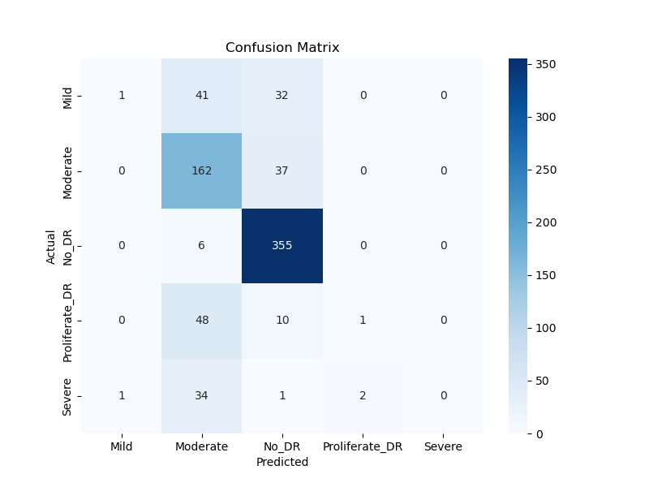
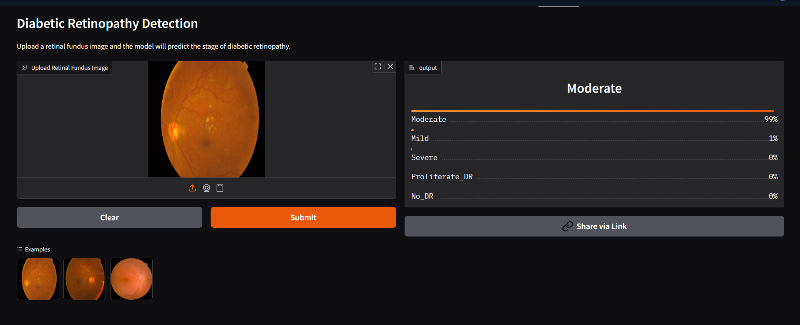

# Diabetic Retinopathy Detection using Deep Learning

A deep learning project that detects **diabetic retinopathy** from retinal fundus images using convolutional neural networks and transfer learning.

---

## Overview

Diabetic retinopathy is a diabetes complication that can lead to blindness if not detected early.  
This project builds a deep learning model that classifies retinal images into different stages of the disease.

The workflow includes:

- Building a **baseline CNN model**
- Applying **transfer learning with EfficientNetB0**
- Evaluating the model with **confusion matrix and classification metrics**

---

## Dataset

Dataset used: **APTOS 2019 Blindness Detection**

https://www.kaggle.com/datasets/sovitrath/diabetic-retinopathy-224x224-2019-data

The dataset contains retinal images classified into 5 stages:

| Label | Class |
|------|------|
| 0 | No_DR |
| 1 | Mild |
| 2 | Moderate |
| 3 | Severe |
| 4 | Proliferate_DR |

---

## Models Implemented

### 1. Baseline CNN
A custom convolutional neural network was built to establish baseline performance.

### 2. Transfer Learning (EfficientNetB0)
A pretrained EfficientNetB0 model was used as a feature extractor and fine-tuned for retinal image classification.

Techniques used:

- Transfer Learning
- Image Preprocessing
- Data Augmentation
- Model Fine-Tuning

---

## Results

| Model | Validation Accuracy |
|------|--------------------|
| CNN Baseline | ~74% |
| EfficientNetB0 | ~78% |

---

## Confusion Matrix



The confusion matrix shows strong performance for **No_DR and Moderate classes**, while minority classes such as **Severe and Proliferate_DR** are harder to classify due to dataset imbalance.

---

## Evaluation Metrics

The model was evaluated using:

- Confusion Matrix
- Precision
- Recall
- F1 Score
- Classification Report

These metrics provide insights into performance across the different disease stages.

---

## Technologies Used

- Python  
- TensorFlow / Keras  
- NumPy  
- Matplotlib  
- Seaborn  
- Scikit-learn  

---

## Project Structure


diabetic-retinopathy-detection-project
│
├── notebook/
│ └── diabetic_retinopathy_model.ipynb
│
├── images/
│ └── confusion_matrix.png
│
├── model/
│ └── retinopathy_model.h5
│
├── requirements.txt
└── README.md


---

## Installation

Clone the repository:

```bash
git clone https://github.com/YOUR_USERNAME/diabetic-retinopathy-detection-project.git
cd diabetic-retinopathy-detection-project
```
Install dependencies:

pip install -r requirements.txt
Running the Project

Launch Jupyter Notebook:

jupyter notebook

Run:

model1.ipynb

--- 

## Live Demo

Try the deployed web app here:
https://huggingface.co/spaces/Shikhar-code/diabetic-retinopathy-detection
---

## Web App Demo


